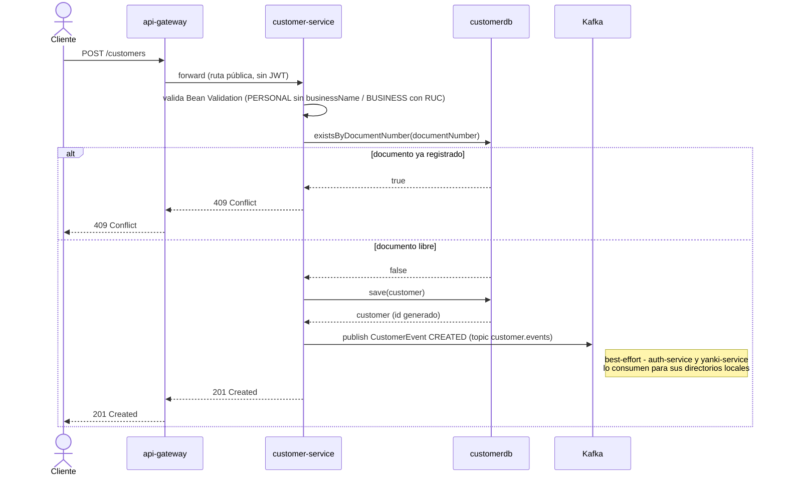
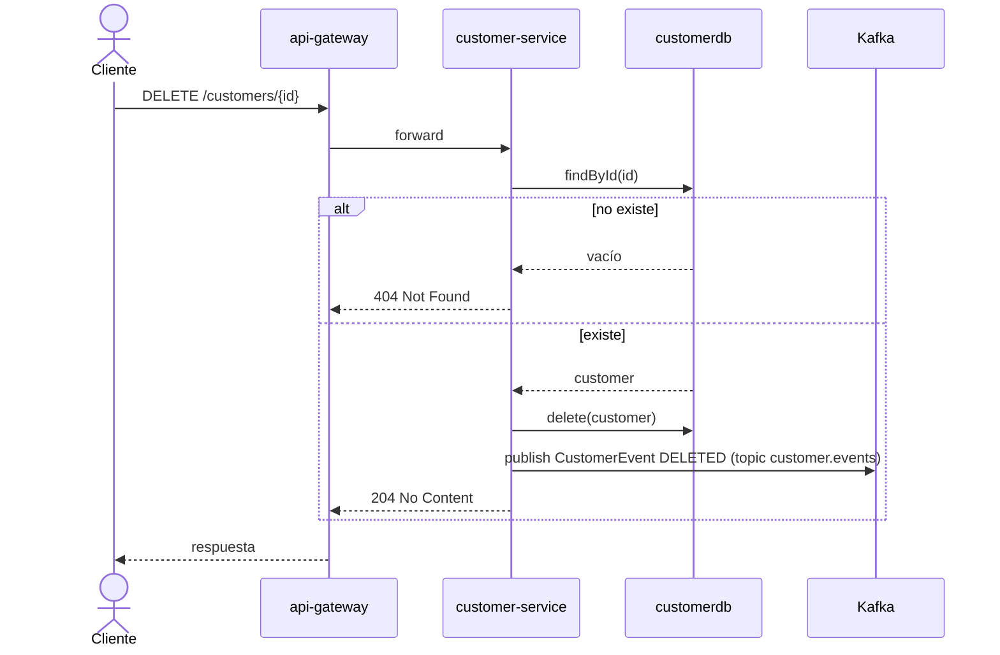

# Diagramas de secuencia — customer-service

Requerimiento no funcional (Parte I): *"Elaborar diagramas de secuencia de cada microservicio."*

## Alta de cliente (con publicación a Kafka)

`customer-service` es el origen del modelo de lectura que consumen `auth-service` y
`yanki-service` — cada alta/baja/modificación publica un evento best-effort a `customer.events`
(no bloquea la respuesta si Kafka está caído).

## Baja de cliente

`DELETE /customers/{id}` también publica el evento correspondiente (`DELETED`), para que los
directorios locales de los microservicios nuevos se mantengan consistentes.

